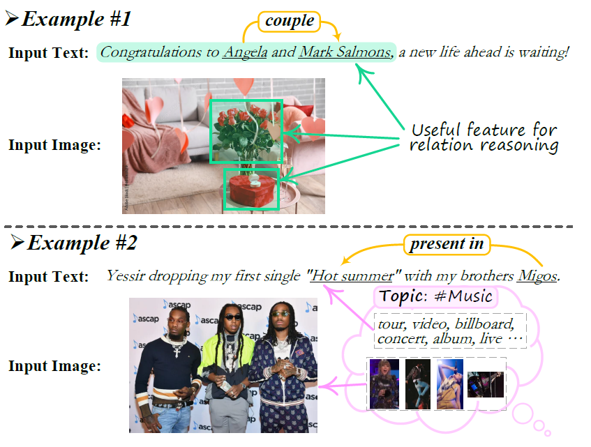
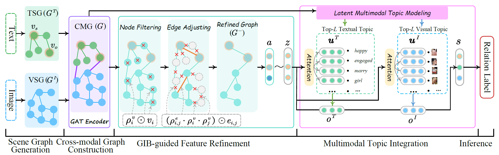

# MRE-ISE
This is the official code for the ACL-23 paper [Information Screening whilst Exploiting! Multimodal Relation Extraction with Feature Denoising and Multimodal Topic Modeling](https://arxiv.org/pdf/2305.11719).


 ### 🎉 Visit the project page: [mmre-page](https://chocowu.github.io/mmre-page/)


## Overview<a name="overview" />
> Relation extraction (RE), determining the semantic relation between a pair of subject and object entities in a given text. 
> Multimodal relation extraction has been introduced recently, where additional visual sources are added to the textual RE as enhancement to the relation inference.
<p align="center">
  
</p>

> Existing research on multimodal relation extraction (MRE) faces with two co-existing challenges, internal-information over-utilization and external-information under-exploitation. 
> To combat that, we propose a novel framework that simultaneously implements the idea of internal-information screening and external information exploiting. 
> First, we represent the fine-grained semantic structures of the input image and text with the visual and textual scene graphs, which are further fused into a unified cross-modal graph (CMG). 
> Based on CMG, we perform structure refinement with the guidance of the graph information bottleneck principle, actively denoising the less-informative features. 
> Next, we perform topic modeling over the input image and text, where the latent multimodal topic features are incorporated to enrich the contexts. 
> On the benchmark MRE dataset, our system strikingly boosts the current best model by over 7 points in F1 score. With further in-depth analyses we reveal the great potentials of our method for the task.
<p align="center">
  
</p>


## Code Usage<a name="code" />

### Setup<a name="Setup" />
Here is a from-scratch script for MMRE:
``` bash 
conda create -n mmre python=3.8
conda activate mmre

# install pytorch
conda install pytorch cudatoolkit -c pytorch -y

# install dependency
pip install -r requirements.txt
pip install -e .
```
### Dataset<a name="data" />
The MRE dataset that we used in our experiments comes from [MEGA](https://github.com/thecharm/Mega).


### Scene Graph paring
To obtain the parsed textual scene graph (TSG) and visual scene graph (VSG), we provide some tools in the directory of `TSG` and `VSG`. Please follow the steps provided in the `README.md`.


### Training
To train the model via `run.sh`:
```angular2html
bash run.sh
```
or
```angular2html
CUDA_VISIBLE_DEVICES=2 python -u run.py \
        --pretrain_name=${PRETRAIN_NAME} \
        --dataset_name=${DATASET_NAME} \
        --num_epochs=30 \
        --batch_size=16 \
        --lr_pretrained=2e-5 \
        --lr_main=2e-4 \
        --warmup_ratio=0.01 \
        --eval_begin_epoch=10 \
        --seed=1234 \
        --do_train \
        --max_seq=40 \
        --max_obj=40 \
        --beta=0.01 \
        --temperature=0.1 \
        --eta1=0.8 \
        --eta2=0.7 \
        --neighbor_num=2 \
        --topic_keywords_number=10 \
        --topic_number=10 \
        --save_path="ckpt"
```


### Testing
Before testing the model, you need to modify the parameter `--do_train` into `--do_test`:
```angular2html
CUDA_VISIBLE_DEVICES=2 python -u run.py \
        --pretrain_name=${PRETRAIN_NAME} \
        --dataset_name=${DATASET_NAME} \
        --batch_size=16 \
        --do_test \
        --load_path="ckpt"
```


## MISC<a name="misc" />


### Citation

If you use this work, please kindly cite:

```
@inproceedings{WUAcl23MMRE,
  author    = {Shengqiong Wu, Hao Fei, Yixin Cao, Lidong Bing, Tat-Seng Chua},
  title     = {Information Screening whilst Exploiting! Multimodal Relation Extraction with Feature Denoising and Multimodal Topic Modeling},
  journal   = {Proceedings of the Annual Meeting of the Association for Computational Linguistics},
  year      = {2023},
}
```


### Acknowledgement

This code is referred from following projects:
[MKGformer](https://github.com/zjunlp/MKGformer); 
[contextualized-topic-models](https://github.com/MilaNLProc/contextualized-topic-models);
[Transformer](https://github.com/huggingface/transformers);
[CLIP](https://huggingface.co/docs/transformers/model_doc/clip#clip),


### License

The code is released under Apache License 2.0 for Noncommercial use only. 